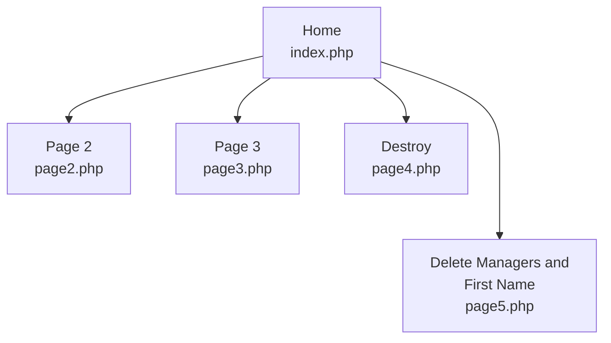

# Session Variables


## Key Ideas

* session_start()
* $_SESSION
* session_destroy()
  * die() / exit()
* unset()


> 
>
> **Session Variable** is a variable that will store values across different pages


```{admonition} Definition
**Session Variable** is a variable that will store values across different pages
```

**session_start()** is a function that tells the webpage to use and access session variables.

__session_destroy()__ is a function that destroys the session variable  and all of its contents

**unset()** is a function that deletes specific data within a session variable associated with a key

**die() or exit()** it can output a message and it terminates the running of the script


```{Note} 
__die()__ is an alias for exit.
```


## Example Code




### Home Page / index.php

```php
<!-- index.php -->
<!DOCTYPE html>
<html>
<head>
<title>Home Page</title>
	<?php
        // To session variable - session start
        // has to be on every page you want to use a session variable
        session_start();
    ?>
</head>
<body>

    <?php
        // assign a values a session variable
        $_SESSION["firstName"] = "Bubba";
        $_SESSION["lastName"]  = "Smith";

        // array review
        $myArray1 = array("Larry","Curly","Moe");
        $myArray2 = array(	"CEO" => "Sally",
        					"CIO" => "Jim",
        					"CFO" => "Suzy",
        					"CSO" => "Billy");

        // different ways to add an item to an array
        array_push($myArray1,"Shemp");
        $myArray1[4] = "Curly Joe";
        $myArray1[count($myArray1)] = "Jimbo";
        $_SESSION["stooges"] = $myArray1;
        $_SESSION["managers"] = $myArray2;	
    ?>

<h1>Session Variables</h1>

<h2>Session</h2>
    <?php
        echo('$_SESSION<br>');
        print_r($_SESSION);
        echo("<br><hr><br>");
        print_r($myArray1);
        echo("<br><hr><br>");
        print_r($myArray2);
        echo("<br><hr><br>");
        print_r($myArray1);
        echo("<br><hr><br>");
        var_dump($_SESSION);
        echo("<br><hr><br>");
    ?>

<h2>People</h2>

    <?php
        // pull and individual 
        echo($_SESSION["stooges"][1]."<br>");
        echo($_SESSION["managers"]["CFO"]."<br>");

        echo("<br><hr><br>");

        $outStooges =$_SESSION["stooges"];
        print_r($outStooges);

        echo("<h3>Stooges</h3>");
        for($i = 0; $i < count($outStooges); $i++)
        {
            echo($outStooges[$i]."<br>");
        }
        echo("<br><hr><br>");
        for($i = 0; $i < count($_SESSION['stooges']); $i++)
        {
            echo($_SESSION["stooges"][$i]."<br>");
        }
    ?>

<br>
<h2>Pages</h2>
<a href="index.php">Home</a><br>
<a href="page2.php">Page 2</a><br>
<a href="page3.php">Page 3</a><br>
<a href="page4.php">Destroy</a><br>
<a href="page5.php">Delete managers and first Name</a><br>

<br><br><br><br>
</body>
</html>
```

<div style="page-break-after: always; break-after: page;"></div>

### Page 2 / page2.php

```php
<!-- "page2.php -->
<!DOCTYPE html>
<html>
<head>
<title>Page 2</title>

    <?php
    	// start session variables
    	// needed on every page that accesses the session variable
		session_start();
	?>

</head>
<body>
<h1>Page 2</h1>
    <?php
    	// purpose here is to show that
    	// information stored in the session variable can be 
    	// accessed on different web pages
        echo($_SESSION["stooges"][1]."<br>");
        echo($_SESSION["managers"]["CFO"]."<br>");

        echo("<br><hr<br>");
    	// print the key and the value
        echo("<h2>Managers</h2>");
        foreach($_SESSION["managers"] as $key => $value){
            echo("Title: ".$key."&nbsp;&nbsp;&nbsp;".$value."<br>");
        }

    ?>

<br>
<h2>Pages</h2>
<a href="index.php">Home</a><br>
<a href="page2.php">Page 2</a><br>
<a href="page3.php">Page 3</a><br>
<a href="page4.php">Destroy</a><br>
<a href="page5.php">Delete managers and first Name</a><br>

<br><hr><br>
    <?php
    	// show the whole session variable
    	print_r($_SESSION);
    ?>
<br><br>

</body>
</html>
```

<div style="page-break-after: always; break-after: page;"></div>

### Page 3 / page3.php

```php
<?php
    // start session variables
    // needed on every page that accesses the session variable
    session_start();

	// delete the entire session variable and all of its data
    session_destroy();

	// link to page 2 to show that the data was deleted
    echo('<br><a href="page2.php">Page 2</a>');

?>
```


### Page 4 / page4.php

```php
<?php
    // start session variables
    // needed on every page that accesses the session variable
    session_start();

	// delete the entire session variable and all of its data
    session_destroy();

	// the header command will automatically take the user
	// back to page 2
	header("Location: page2.php");
    
	//exit the script
	// NOTE: exit() can also be used instead of die()
    die();

?>
```


### Delete Managers and First Name / page5.php

```php
<?php
    // start session variables
    // needed on every page that accesses the session variable
    session_start();


    // delete specific data by keys in the session variable
    unset($_SESSION['managers']);
    unset($_SESSION['firstName']);

	// the header command will automatically take the user
	// back to page 2
	header("Location: page2.php");

	//exit the script
	// NOTE: exit() can also be used instead of die()
    die();

?>

```

