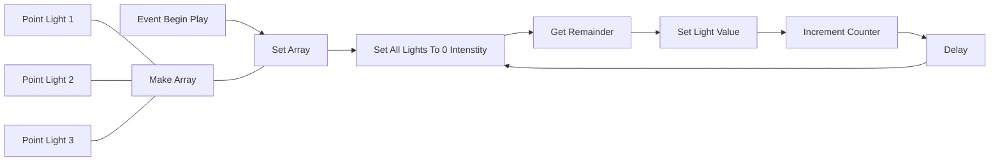

# Program Lights In A Sequence - Using Functions

* **Goal:**
   Create three light sources that illuminate in sequence—1, 2, 3—and then repeat continuously.

------

  **Process:**

  1. Start a new Actor class.
  2. Add three light sources to the viewport.
  3. Store the lights in an array. This allows for easy access to the correct light based on the counter. The counter's **remainder** (counter value modulo 3) will indicate which light to activate.
  4. Create and initialize a counter. Use the **modulus operator** (`%`) to determine which light to turn on.
  5. Turn off all the lights.
  6. Calculate the remainder: `counter % 3`.
  7. Use the remainder value to activate the corresponding light from the array.
  8. Increment the counter.
  9. Repeat the process, starting again with turning off all the lights.

## Viewport

Add three light sources to the viewport. You can also configure each lamp's characteristics here, such as intensity, color, or attenuation radius.

## Actor Class - Main Blueprint

###### 

<!--

-->

---

## Function - Set Light Intensity To Zero

---

## Function - Get Remainder - Choose The Correct Array Element (Light)

| Add input and output details

---

## Set Selected Light Values

---

