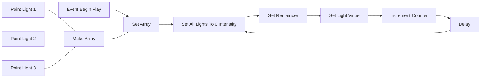

```mermaid
flowchart LR

EvtBeginPlay["Event Begin Play"]
SetArray["Set Array"]
StLght0["Set All Lights To 0 Intenstity"]
PL1[Point Light 1]
PL2[Point Light 2]
PL3[Point Light 3]
MKA[Make Array]
GR[Get Remainder]
SLV[Set Light Value]
IC[Increment Counter]
Delay[Delay]


PL1 --- MKA
PL2 --- MKA
PL3 --- MKA


EvtBeginPlay --> SetArray

MKA --- SetArray
SetArray --> StLght0
StLght0 --> GR
GR --> SLV
SLV --> IC
IC --> Delay
Delay --> StLght0
```